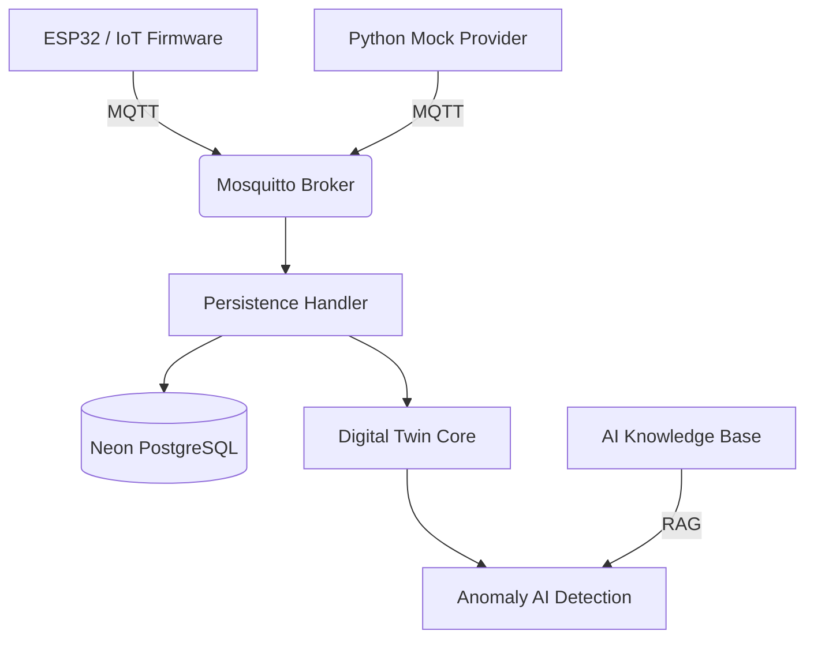

# ⚡ Forzy | Industrial Intelligence

Projeto de **Gêmeo Digital (Digital Twin)** e monitoramento preditivo para motores elétricos industriais. Desenvolvido para a Challenge FIAP em parceria com a Promon.

## 🏗️ Arquitetura do Sistema

O ecossistema Forzy utiliza uma arquitetura baseada em eventos (EDA) e princípios de **Clean Architecture** para garantir agnosticismo de hardware e escalabilidade.



## 🛠️ Tecnologias Utilizadas
- **Backend:** Python 3.10+, FastAPI, SQLAlchemy.
- **IoT:** C++, PlatformIO, PubSubClient (MQTT).
- **Banco de Dados:** Neon PostgreSQL (Serverless).
- **IA:** LangChain, OpenAI, EasyOCR (Preparação).
- **Infra:** Docker, Mosquitto MQTT.

## 🚀 Como Executar (Sprint 1)

### 1. Requisitos
- Docker & Docker Compose
- Python 3.10+
- `.env` configurado com a URL do Neon

### 2. Subir Infraestrutura
```powershell
docker-compose up -d
```

### 3. Iniciar Ingestão (Simulação)
```powershell
python -m backend.apps.ingestion_service.main
```

### 4. Iniciar Persistência (Neon Bridge)
```powershell
python -m backend.apps.digital_twin_core.persistence_handler
```

## 📅 Cronograma de Implantação

| Sprint | Foco | Entregáveis Principais |
| :--- | :--- | :--- |
| **Sprint 1** | **Fundação** | MQTT, Neon DB, Mock Ingestion, Estratégia IA/OCR. |
| **Sprint 2** | **Inteligência** | Implementação OCR, Dashboards de Telemetria, Detecção de Anomalias. |
| **Sprint 3** | **Conhecimento** | Integração RAG com Manuais, Agente de IA para Diagnóstico. |
| **Sprint 4** | **Hardware Real** | Integração com Sensores Físicos e Validação em Bancada. |

## ⚖️ Governança e Qualidade
- **Zero Hardcode:** Todas as especificações técnicas são carregadas via metadados JSON.
- **Fail-Fast:** Validação rigorosa de payloads via Pydantic.
- **Soberania de Dados:** Todos os eventos críticos são logados localmente e na nuvem para auditoria.
