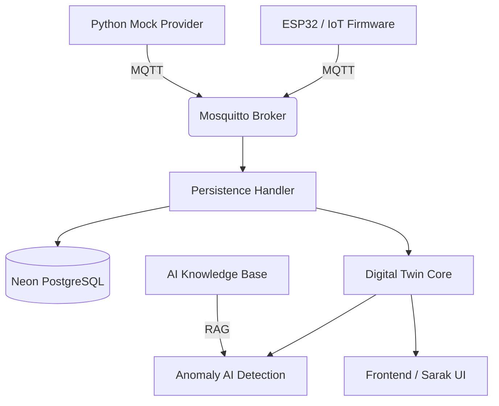

# Integrantes 
- Igor Paixão Sarak RM 563726
- Luiz Henrique Poss RM562177
- Lucca Phelipe Masini RM 564121
- Bernardo Braga Perobeli RM 562468
- Felipe Stefani Honorato RM 563380

# ⚡ Forzy | Industrial Intelligence

Projeto de **Gêmeo Digital (Digital Twin)** e monitoramento preditivo para motores elétricos industriais. Desenvolvido para a Challenge FIAP em parceria com a Promon. O Forzy não é apenas um dashboard, mas um ecossistema de inteligência industrial que conecta o chão de fábrica ao monitoramento de alta fidelidade.

---

## 🏗️ Arquitetura do Sistema

O ecossistema Forzy utiliza uma arquitetura baseada em eventos (EDA) e princípios de **Clean Architecture** para garantir agnosticismo de hardware e escalabilidade.



---

## 📂 Organização do Projeto

O repositório é estruturado de forma modular para permitir a transição futura de um monorepo para microsserviços independentes.

### 1. `/backend` (Cérebro do Sistema)
Dividido em aplicações (apps) independentes que compartilham infraestrutura comum:
*   **`apps/ingestion_service`**: Gerencia a entrada de dados via MQTT.
*   **`apps/digital_twin_core`**: Processa o estado dos ativos em tempo real e lida com a persistência no NeonDB.
*   **`apps/asset_manager`**: Gestão administrativa de máquinas, sensores e usuários.
*   **`apps/ai_knowledge`**: Engine de IA que utiliza RAG para diagnósticos técnicos.

### 2. `/frontend` (Interface Soberana)
Aplicação React + Vite focada em visualização de alta performance.
*   **Sarak Lib UI:** A renderização visual é delegada a um motor de design externo (`@sarak/lib-ui-core`), garantindo consistência visual e separação total entre lógica de negócio e design system.
*   **Estabilização:** A dependência da UI é fixada via GitHub Hash para garantir que o projeto seja portátil e imune a quebras por atualizações externas.

### 3. `/iot_firmware` (Edge Computing)
Código fonte para dispositivos ESP32, responsável pela leitura de sensores e comunicação segura via protocolo MQTT.

### 4. `/api`
Endpoints e funções serverless para integração rápida e deploys em plataformas como Vercel.

---

## 🛠️ Tecnologias de Elite
*   **Backend:** Python 3.10+, FastAPI, SQLAlchemy.
*   **Interface:** React, Vite, Framer Motion, ECharts.
*   **UI Engine:** Sarak Sovereign Design System (v13.9).
*   **Banco de Dados:** Neon PostgreSQL (Serverless/Cloud).
*   **Comunicação:** Mosquitto MQTT (Broker), WebSockets (Real-time).
*   **Infra:** Docker, Docker Compose.

---

## 🚀 Como Executar o Ecossistema

### 1. Pré-requisitos
*   Docker & Docker Compose instalado.
*   Ambiente Python 3.10 configurado.
*   Arquivo `.env` na raiz com as credenciais do banco Neon.

### 2. Subir Infraestrutura (Broker & Dependências)
```bash
docker-compose up -d
```

### 3. Instalação e Execução
O projeto conta com um script de automação para facilitar o setup:
```powershell
# Iniciar todo o ecossistema (Backend + Frontend)
.\RUN_FORZY.bat
```

### 4. Instalação Manual do Frontend
Caso deseje rodar apenas a interface:
```bash
cd frontend
npm install
npm run dev
```

---

## 🛡️ Gestão de Dependências (Entrega de Projeto)
Para garantir que o professor consiga rodar o projeto sem erros de caminhos locais, a biblioteca de UI está configurada via link direto do repositório remoto:
`"@sarak/lib-ui-core": "git+https://github.com/Lib-Sarak/Sarak-Lib-UI-Core.git#ee6e36c"`

---
**Equipe Forzy | Industrial Intelligence - FIAP 2026**
